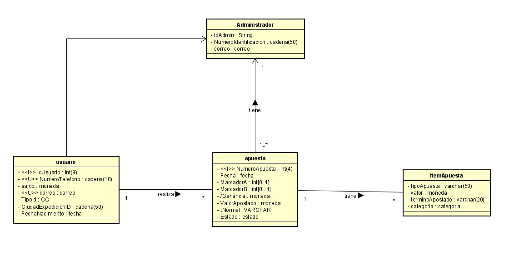

# ECIBET
## Informacion General
- Curso: Arquitectura de Software: 2021 - 1
- Integrantes: Nikolai Bermudez - Verbo Camacho - Miguel Castellanos
- Profesor: Sebastian Henao Pinzon

## Roles
- Nikolai Bermudez Vega: Scrum Master
- Verbo Camacho: Developer
- Miguel Castellanos: Developer
- Sebastian Henao Pinzon: Product Owner

## Descripción del proyecto

## Casos de uso

## Modelo Entidad - Relacion

# MockUps
## Log In

## Inicio

