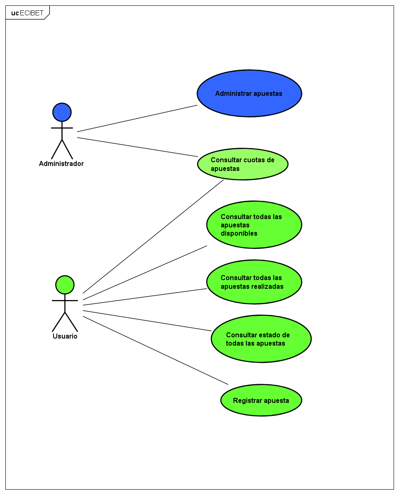
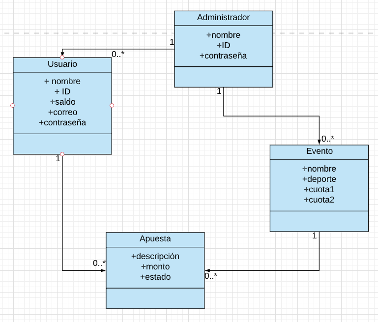
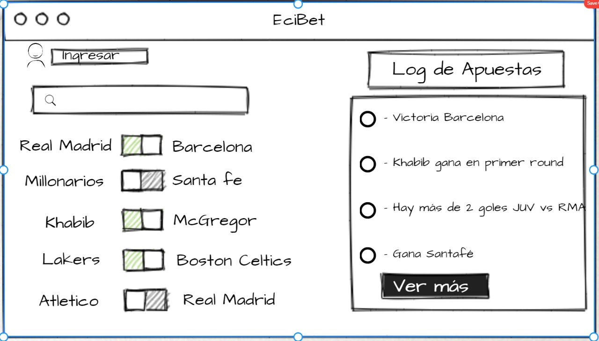

# ECIBET :gem:

## Descripción del proyecto :currency_exchange:
ECIBET es un aplicativo web para una empresa de apuestas enfocadas en el futbol ingles con una actualizacion constante de la cuota, empezando en el mercado y con ganas de revolucionar la manera en que se generan las apuestas.

## Informacion General
- Curso: Arquitectura de Software: 2021 - 1
- Integrantes: Nikolai Bermudez - Verbo Camacho - Miguel Castellanos
- Profesor: Sebastian Henao Pinzon

## Roles :bell:
- Nikolai Bermudez Vega: Scrum Master
- Verbo Camacho: Developer
- Miguel Castellanos: Developer
- Sebastian Henao Pinzon: Product Owner

### Funcionalidades importantes :white_check_mark:
- Generar apuestas (Usuario)
- Ver apuestas en tiempo real (Usuario - Administrador)
- Estado de cuenta (Usuario - Administrador)
- Informacion total de las apuestas realizadas (Administrador)

### Manual de Usuario :lock:

## Arquitectura de Diseño
## Casos de uso

## Modelo Entidad - Relacion

# MockUps
## Log In

## Inicio

## Despliegue Heroku :white_check_mark:

## *Integracion continua en CircleCi* :white_check_mark:
## Reporte de analisis *Codacy* :white_check_mark:
## Descripcion de la Metodologia :unlock:
### Sprint 1 :100: Taiga [aqui](https://tree.taiga.io/project/verbocamacho-ecibeteci-bet-project/timeline)
### Sprint 2 :100:
### Sprint 3 :100:

