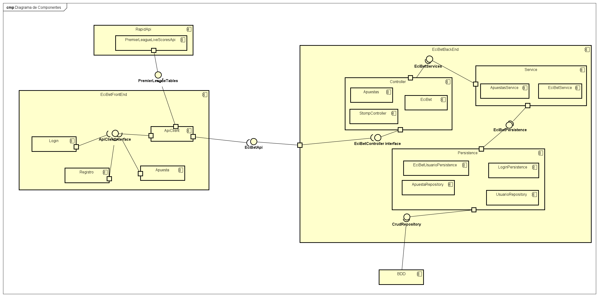
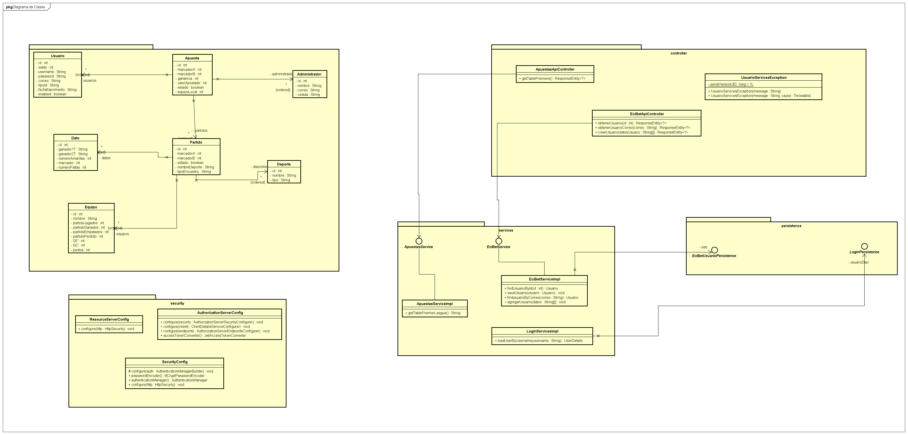
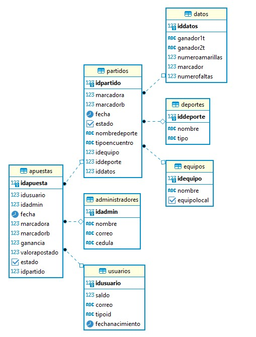
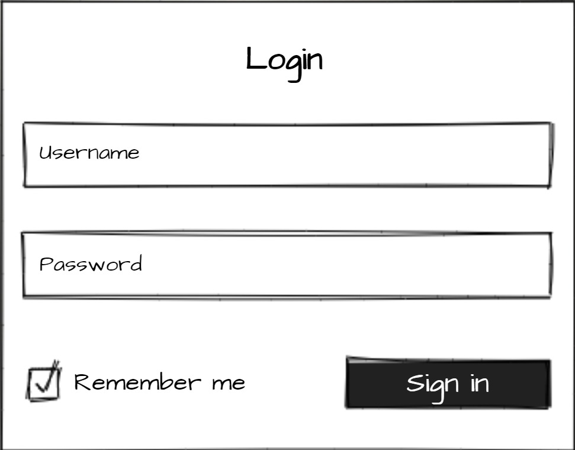
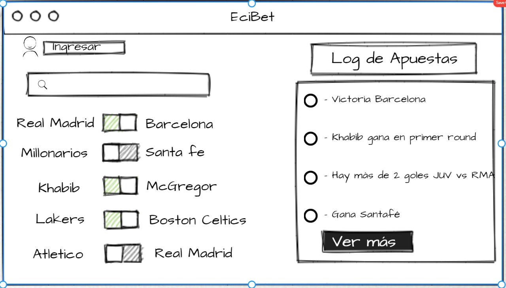

 :gem:

## Informacion General
- Curso: Arquitectura de Software: 2021 - 1
- Integrantes: Nikolai Bermudez - Verbo Camacho
- Profesor: Sebastian Henao Pinzon

## Roles :bell:
- Nikolai Bermudez Vega: Scrum Master
- Verbo Camacho: Developer
- Sebastian Henao Pinzon: Product Owner

## Descripción del proyecto :currency_exchange:
ECIBET es un aplicativo web para una empresa de apuestas enfocadas en el futbol ingles con una actualizacion constante de la cuota, con ganas de revolucionar la manera en que se generan las apuestas. Brindando seguridad y confianza a cada uno de nuestros clientes a la hora de que ellos realicen alguna apuesta. 

### Funcionalidades importantes :white_check_mark:
- Generar apuestas (Usuario)
- Ver apuestas en tiempo real (Usuario - Administrador)
- Estado de cuenta (Usuario - Administrador)
- Informacion total de las apuestas realizadas (Administrador)

### Manual de Usuario :lock:
[Manual](https://ecibets.gitbook.io/u/manual-de-usuario-ecibet)

## Comandos
Para compilar y correr las pruebas: ```mvn package```

Para ejecutar y utilizar el programa: ```mvn exec:java -Dexec.mainClass="Main```

Para ejecutar las pruebas: ```mvn test```

Para generar javadoc con maven: ```mvn javadoc:javadoc```

Para generar javadoc de las pruebas: ```mvn javadoc:test-javadoc```

**IMPORTANTE:** Para poder utilizar el aplicativo es necesario compilar primero el proyecto con **mvn package**.

## Despliegue Heroku :white_check_mark:
[](http://ecibets.herokuapp.com)


## *Integracion continua en CircleCi* :white_check_mark:
[](https://app.circleci.com/pipelines/github/ECIBET/ECI-BET-PROJECT)

## Reporte de analisis *Codacy* :white_check_mark:
[](https://www.codacy.com/gh/ECIBET/ECI-BET-PROJECT/dashboard?utm_source=github.com&amp;utm_medium=referral&amp;utm_content=ECIBET/ECI-BET-PROJECT&amp;utm_campaign=Badge_Grade)

## Descripcion de la Metodologia :unlock:
- Planeacion (link en la imagen)

[](https://tree.taiga.io/project/verbocamacho-ecibeteci-bet-project/backlog)

## Arquitectura de Diseño
## Casos de uso


## Modelo Componentes 


## Diagrama de Clases


## Diagrama de BD


## Diagrama de Despliegue


# MockUps
## Log In

## Inicio



## Construido
[IntelliJ IDEA](https://www.jetbrains.com/es-es/idea/) Editor de JAVA donde se puede compilar el proyecto.

[Spring](https://spring.io) Framework Spark


