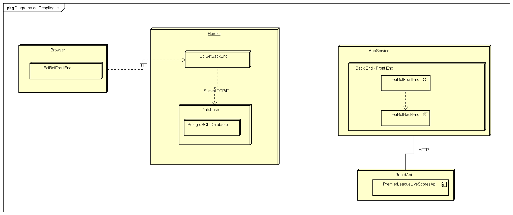

 :gem:

## Informacion General
- Curso: Arquitectura de Software: 2021 - 1
- Integrantes: Nikolai Bermudez - Verbo Camacho
- Profesor: Sebastian Henao Pinzon

## Roles :bell:
- Nikolai Bermudez Vega: Scrum Master - Full Stack Developer
- Verbo Camacho: Full Stack Developer
- Sebastian Henao Pinzon: Product Owner

## Descripción del proyecto :currency_exchange:
ECIBET es un aplicativo web para una empresa de apuestas enfocadas en el futbol ingles con una actualizacion constante de la cuota, con ganas de revolucionar la manera en que se generan las apuestas. Brindando seguridad y confianza a cada uno de nuestros clientes a la hora de que ellos realicen alguna apuesta. 

### Funcionalidades importantes :white_check_mark:
- Generar apuestas (Usuario)
- Ver apuestas en tiempo real (Usuario - Administrador)
- Estado de cuenta (Usuario - Administrador)
- Informacion total de las apuestas realizadas (Administrador)

### Manual de Usuario `gitbook` :lock:
[`Manual`](https://ecibets.gitbook.io/u/manual-de-usuario-ecibet)

## Comandos
Para compilar y correr las pruebas: ```mvn package```

Para ejecutar y utilizar el programa: ```mvn exec:java -Dexec.mainClass="Main o java -jar target/java-getting-started-1.0.jar```

Para ejecutar las pruebas: ```mvn test```

Para generar javadoc con maven: ```mvn javadoc:javadoc```

Para generar javadoc de las pruebas: ```mvn javadoc:test-javadoc```

**IMPORTANTE:** Para poder utilizar el aplicativo es necesario compilar primero el proyecto con **mvn package**.

## Despliegue Heroku :white_check_mark:
[](http://ecibets.herokuapp.com)


## *Integracion continua en CircleCi* :white_check_mark:
[](https://app.circleci.com/pipelines/github/ECIBET/ECI-BET-PROJECT)

## Reporte de analisis *Codacy* :white_check_mark:
[](https://www.codacy.com/gh/ECIBET/ECI-BET-PROJECT/dashboard?utm_source=github.com&amp;utm_medium=referral&amp;utm_content=ECIBET/ECI-BET-PROJECT&amp;utm_campaign=Badge_Grade)

## Descripcion de la Metodologia :unlock:
- Planeacion (link en la imagen)

[](https://tree.taiga.io/project/verbocamacho-ecibeteci-bet-project/backlog)

## Arquitectura de Diseño
## Casos de uso


## Modelo Componentes 


## Diagrama de Clases


## Diagrama de BD


## Diagrama de Despliegue


# MockUps
[MockUps](https://github.com/ECIBET/ECI-BET-PROJECT/tree/master/img/mockups)

# Requerimientos no Funcionales
## 1.Usabilidad
Se hicieron pruebas de usabilidad con un framework llamado MouseFlow el cual nos ayuda a monitorear el uso de la aplicacioncon metricas como los clicks, un mapa de calor del uso e interaccion de los usuarios en la pagina y un dashboard con estadisticas y demas informacion de la interaccion de la pagina. A continuacion podremos observar cada una de la metricas descritas

### Clics


### HeatMap


### Dashboard


## 2. Usabilidad
Se realizaron pruebas responsive sobre toda la pagina, de tal modo de que pudieramos observar que sin importar el tamano se puede ver el mismo contenido de manera organizada. A continuacion podremos obsevar como se puede ver la pagina en un tamaño para celular


## 3. Escalabilidad
Se hicieron pruebas de carga una vez desplegada la aplicación en el servicio de despliegue de aplicaciones web de azure (Azure App Service). En primera instancia se realizaron las pruebas con las configuraciones que vienen por defecto en el App Service Plan esto quiere decir con una sola instancia del servidor y el monitor nos arrojó los siguientes resultados.


El uso de la CPU usando un nodo es de aproximadamente un 37% realizando dos mil peticiones como se muestra en la siguiente imagen.

Finalmente se escaló el App service plan para que use 3 instancias de servidor, se hicieron las pruebas con las mismas dos mil peticiones y los resultados fueron los siguientes:


Lo cual podríamos inferir que al usar prácticamente toda la capacidad de procesamiento de dos de los servidores realizó las dos mil peticiones mucho más rápido como se puede observar a continuación.


Esto con diferencia a los primeros datos obtenidos con ayuda de la herramienta JMeter


## Construido
[IntelliJ IDEA](https://www.jetbrains.com/es-es/idea/) Editor de JAVA donde se puede compilar el proyecto.

[Spring](https://spring.io) Framework Spark


